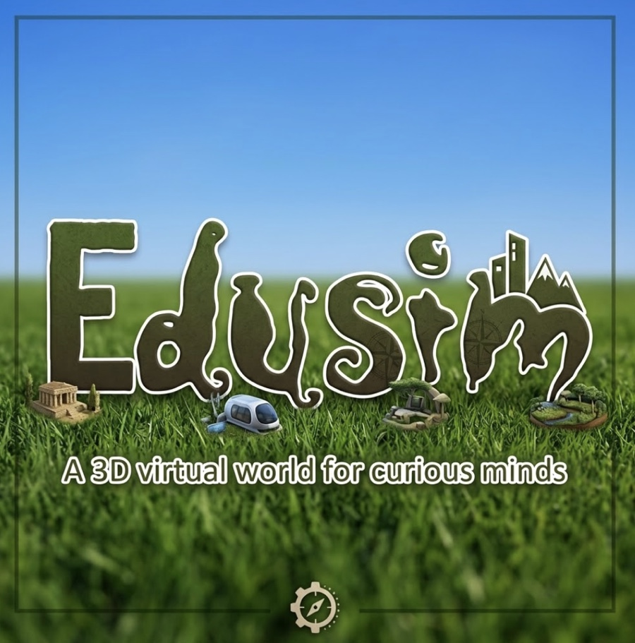

<div align="center">



**Build it. Code it. Explore it.**

A single-user 3D sandbox that runs entirely in a browser — no download, no account,
no backend, no ads.

[**▶ Play**](https://edisimwebv1-production.up.railway.app) ·
[Website](https://richwhitegreenbush.github.io/EdisimWEB_V1/) ·
[Tutorials](https://richwhitegreenbush.github.io/EdisimWEB_V1/guide/tutorials.html) ·
[Hands-On Guide](https://richwhitegreenbush.github.io/EdisimWEB_V1/guide/) ·
[For Teachers](https://richwhitegreenbush.github.io/EdisimWEB_V1/guide/teachers.html)

</div>

---

## What it is

Edusim: Web Edition is a Second Life-inspired sandbox for students, in the spirit of the
original Edusim3D. You walk a rolling landscape as a five-foot person, build models out
of stretchable primitives, teach them to move with Scratch-style blocks, and explore
ready-made worlds that already have things in them worth programming.

It is pure client-side [Three.js](https://threejs.org) — no server, no database, no
sign-in. Everything a student makes is saved in their own browser and can be exported to
a file they can keep or send to someone else.

Three things to do, meant to be done in that order:

### 🔨 Build it

**Menu ▸ Create Model** drops a construction piece on the ground — a cube, sphere,
cylinder or tetrahedron — with a floating hammer icon that opens its menu. (**Load
Object** lives inside this group too: importing a model, painting a balloon, dropping a
light orb and hanging a browser panel are the same job of putting something of your own
into the world.) Stretch the piece by its
corners, turn it on three snapping rings, lift it in mid-air to stack it, paint it or
wrap an uploaded photo around it, connect it to the pieces it touches, then press
**Render Model** to fuse the cluster into one ordinary object.

### 🧩 Code it

Click anything and choose **Program** to open a drag-and-drop block editor:

| Category | Blocks |
| --- | --- |
| **Control** | `repeat … times` · `forever` · `wait … seconds` · `duplicate … ft away` |
| **Motion** | `move X/Y/Z by … feet` · `rotate … degrees` |
| **Looks** | `change size by … %` · `change color to …` |

`repeat` and `forever` are C-shaped and hold other blocks inside them. Programs run
immediately, save with the object, and restart themselves the next time the world loads —
a green ▶ floats above anything that has one, so it can be run again from the top.
`duplicate` copies the whole object, program and all, which is how one robot becomes a
row of them.

### 🗺️ Explore it

**Menu ▸ Load World** rebuilds the whole scene from one of the prebuilt worlds. Every
object in them is clickable, resizable, movable, programmable and saveable, exactly like
something you placed yourself. Every world but the empty one has two **activity boards**
standing in it, each setting a coding challenge for a real object nearby and printing the
exact blocks to snap together for it.

| World | What's in it |
| --- | --- |
| **The Park** | Where you start. A pond with geese, a bandstand, a playground, a stone arch bridge and the historic bear dens |
| **The Museum** | A skylit gallery — paintings generated in the style of six art movements, sculptures, a programmable mobile |
| **The Library** | A reading room under a glazed lantern roof: stacks, Dewey signs, a card catalog, a globe on its tilted axis |
| **The Moon** | Tranquility Base — the lunar module, the rover at its real 10ft length, and Earth in a black sky |
| **On Mars** | A crewed outpost you walk into through an airlock, with hydroponics, a rover and a dust devil outside |
| **Dinosaur Island** | The late Cretaceous at full size — a T. rex whose hip is taller than an adult, a fossil dig, a volcano |
| **Fantastic Voyage** | Inside the human body: walk-around organs, an artery you walk through, and a chart for every system |
| **My World** | Open grass and five trees, plus three boards: what the place is for, a rocket to build, and the program that flies it |

Two more worlds — **1940's New York** and **Under the Sea** — are deliberately *not* in
the menu. Each is reached only by finding and clicking a billboard inside another world,
which loads it like any other preset.

## Other things to put in a world

- **Import** — your own `.gltf` / `.glb` / `.obj` models (up to 200MB), plus `.png`,
  `.jpg` and animated `.gif` images (up to 50MB). Everything is auto-scaled to 5ft tall
  on the way in, so nothing lands a mile wide or too small to find.
- **Draw** — a multi-stroke paint pad. Paint a shape in as many colours as you like and
  it inflates into a puffy 3D balloon still wearing your painting.
- **Light Orb** — a real `PointLight` with a glowing core, not a picture of one. It
  lights the terrain and anything standing near it.
- **Web Browser** — a live, interactive web page on a panel in the world, with its own
  address bar. Every world already has one by its spawn point. Note that many sites
  (Google, YouTube, Facebook, X, most banks) send headers that forbid being framed at
  all; Wikipedia, MDN and most blogs work fine. Click the blue ✎ above a panel to resize,
  move or program the panel itself, since ordinary clicks go to the web page.
- **VR Headset View** — WebXR when a headset is present (thumbstick to walk, trigger-drag
  to turn, an in-scene menu panel), and a fullscreen side-by-side stereo view with
  device-orientation head-look when it isn't, so a phone in a cardboard holder — or a
  plain laptop — still gets the split view. `Esc` comes back.

## Controls

| | |
| --- | --- |
| **Walk / turn** | `↑` `↓` `←` `→`, or the on-screen D-pad on a touchscreen |
| **Look around** | Drag anywhere on the world — mouse, finger or stylus |
| **Edit an object** | Click or tap it → Size / Move / Program (and Colour, for a light orb) |
| **Run a program again** | Click the green ▶ floating above the object |

Two fingers at once is fine, so a tablet can walk with one thumb and look with the other.

## Saving

Two independent systems, on purpose:

- **Automatic.** Every placement and edit is written to IndexedDB in that browser, so a
  refresh returns the world exactly as it was left. Choosing a world from the menu again
  is the deliberate way to get a clean copy.
- **World files.** **Save World** exports everything — including models built in-app and
  imported files, base64-encoded — as a portable `.json`. **Load World File** reads one
  back. That is how a student hands work in, or sends a world to a classmate.

## Running it locally

```bash
npm install
npm run dev
```

```bash
npm run build     # static bundle in dist/
npm run preview   # serve that bundle
```

There is no backend and no lint or test setup. `npm run build` produces a plain `dist/`
folder that can be hosted anywhere static.

The marketing site and the printable guide are hand-written HTML in `docs/`, served by
GitHub Pages; `npx vite docs` previews them locally.

## Layout

```
src/
  main.js            composition root — everything is wired up here
  config.js          all the tunable constants, in feet
  SceneSetup.js      terrain, lighting and the per-world themes
  PlacedRegistry.js  the single source of truth for everything in the scene
  WorldStore.js      IndexedDB persistence + rehydration
  WorldPresets.js    the prebuilt worlds, as lists of records
  props/             every object in every world, generated in code
  ...                the builder, the block editor, VR, touch, and the rest
docs/                the marketing site + the printable Hands-On Guide
public/              runtime-fetched assets (the maple tree, photo textures)
```

Worlds are **data, not scenes**: a preset is just a list of the same records IndexedDB
and a world file already hold, so a new world is one layout function plus one line in a
table, and everything in it saves, exports and rehydrates with no code of its own.
Nothing stores geometry — models, balloons, props and built models all rebuild themselves
from named parameters every load.

**[`CLAUDE.md`](CLAUDE.md) is the architecture tour** — how each system works, why it is
built that way, and the traps that were hit getting there. Read it before changing
anything structural.

## Credits

Terrain and surface photographs are CC0 from [ambientCG](https://ambientcg.com) — see
[`public/textures/CREDITS.md`](public/textures/CREDITS.md). Everything else in the worlds
is generated in code. Built with [Three.js](https://threejs.org) and
[Vite](https://vite.dev).
